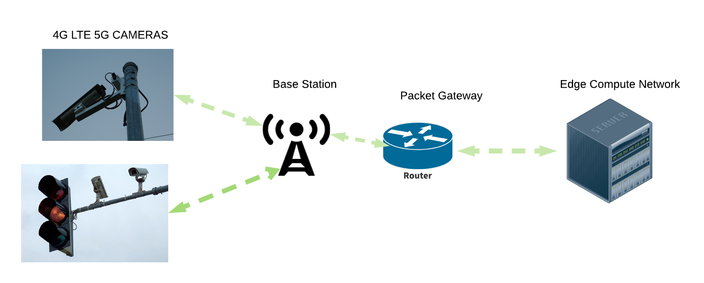
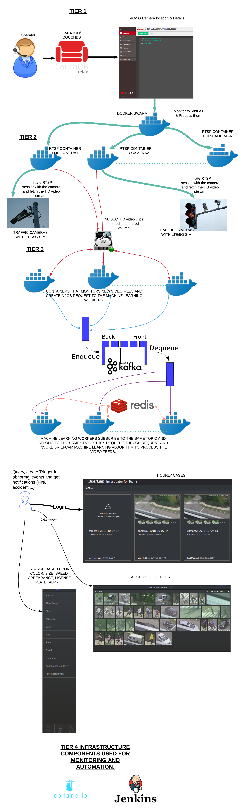

# MEC_POC
------------------
This is a Mobile Edge Compute platform Proof Of Concept (POC).

The POC is to demonstrate live object detection (Person, vehicle) from surveillance traffic camera video feed on the Edge Compute network and thereby proving the Edge compute network capabilities such as Low Latency Compute power and 4G LTE / 5G  Bandwidth savings for the Mobile Operator.

There are 3 Tiers to this Architecture.

TIER 1:
-------
An Administrator shall be allowed to login to CouchBD via Fauxton front end web interface.
After logging in, the administrator shall be allowed to create a database named “briefcam” and further be allowed to create a document in this database listing the traffic camera details that hosts the RTSP service. (such as 4G LTE/5G IPv4/v6 address or Domain name).

Note 1: The Adminstrator shall be allowed to create/update/delete a camera information.

Note 2: Dockers (ssriram1978/front_end:latest, 3apaxicom/fauxton, wurstmeister/kafka:latest, couchdb, wurstmeister/zookeeper) are used in this TIER 1.

Note 3:  In front_end directory, run the docker-compose command 
"docker-compose -d up"
"docker-compose down"

The front end shall read the document created in the database and shall spawn a new RTSP media recorder container instance and pass on the IP camera details to the new instance.

TIER 2:
-------
The traffic camera information is passed on to the RTSP (Real Time Streaming Protocol) service infrastructure which connects to the RTSP server hosted on the Traffic camera via the provided credentials (username, password, IP address,...).
This service start capturing the video feed from the specified traffic camera.
The video feed is split into 10-30 second video clips (configurable) and passed down to the TIER 3 Machine learning algorithms that identifies objects in the video feeds.

Note 1: Dockers (ssriram1978/rtsp_recorder:latest) is used in this TIER 2.

TIER 3:
-------
The video feeds are fed into the machine learning algorithm compute network by a swarm of workers and the identifed objects can be visually inspected, queried and fetched via the graphical user interface portal via the hosted web service. ( provided by a Vendor -  https://www.briefcam.com/) 

Any anomalies and triggers can be set based upon a certain pattern (RED color vehicle, person wearing glasses, person with black hair) can be set/queried/fetched via the webportal.

Note 1: Dockers (ssriram1978/job_dispatcher:latest, ssriram1978/machine_learning_workers:latest, wurstmeister/kafka:latest, portainer/portainer, redis:latest, wurstmeister/zookeeper) are used in this TIER 3.

Note 2: In machine_learning_workers directory, run the docker stack command. 
“docker stack deploy -c docker-compose.yml machine_learning_workers”
“docker stack rm machine_learning_workers”

To run all 3 Tiers together: 
---------------------------
In the main briefcam directory, run 
“docker stack deploy -c docker-compose.yml briefcam”
“docker stack rm briefcam”
